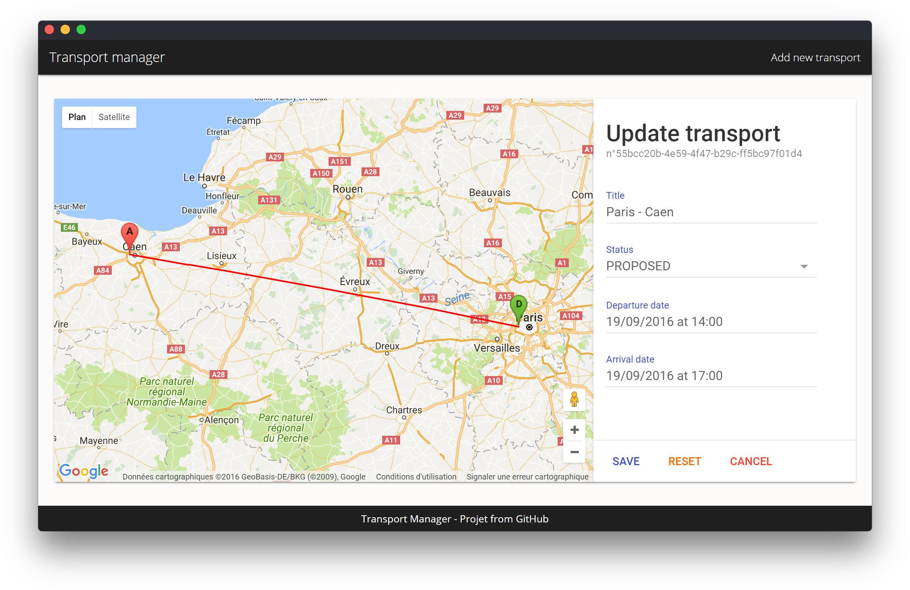

# Transport manager
> Projet from [msalles-winn](https://github.com/msalles-winn/base-project/)

Docker image available at https://hub.docker.com/r/yboyer/winn-project/



### Technologies
- __Server__
  - `Node.js`
    - `nedb` - InMemory DBMS
    - `express` - Web framework
      - `body-parser` - JSON request playload parser
    - `node-uuid` - UUID genarator
  - `mocha` - Tests
    - `supertest` - HTTP assertions
- __Client__
  - `angular`
    - `jspm` - Angular dependencies
      - `systemjs` - Dynamic module loader
    - `babel` - 6to5 compiler
    - `material-design-lite` - Google's material design style
    - `google-maps` - Google Maps
  - `gulp` - Task runner
  - `browser-sync` - Synced website
  - `sass` - Dynamic style sheet generator
  - `karma` - Tests on browsers (rendering and methods of Angular components)
    - `jasmine` - Tests


- Production
  - `docker` - App packager

---
### Pro
  - Latest version of [Angular](http://angular.io/): `V2.0.1`
  - [Docker image](https://hub.docker.com/r/yboyer/winn-project/) size is about 20MB (shipped with `Node.js`)
  - Lightweight DBMS and subset of MongoDB with [`NeDB`](https://github.com/louischatriot/nedb)
  - Use of `ECMAScript 6` and `ECMAScript 7`
  - NPM scripts to do everything
  - Automatic front-end development tasks with `Gulp`
  - Automatic Docker image build, push and deployment with shell scripts

### Cons
  - No isomorphic support the Angular app (See [Universal](https://github.com/angular/universal))
  - ~~No server-side verifications about the transport object sent by others ways than the built website~~ - See commit [00dd21](/../../commit/00dd21)
  - ~~No checks on the date (eg when the arrival date is earlier than the departure date)~~ - See commit [c12ad9](/../../commit/c12ad9) but.... wait.. time travels are allowed ?!
  - No UX for the pending actions sent by clients

---

## Usage: _(Git)_
### Install
##### Clone the GitHub repo:
```bash
git clone https://github.com/yboyer/winn-project.git
cd winn-project
```
##### Install dependencies:
```bash
npm i
```
##### Build client:
```bash
npm run build
```
### Run
##### Run and listen on port `3000`
```bash
npm start
```

## Usage: _(Docker)_
##### Download the Docker image from the hub:
```bash
docker pull yboyer/winn-project
```
##### Run and listen on port `3000`
```bash
docker run yboyer/winn-project
```

## Global Development
#### NPM scripts
  - `npm start [PORT]` to launch the server
  - `npm run build` to build the client
  - `npm run doc_client` to generate doc for the client
  - `npm run doc_server` to generate doc for the server
  - `npm run doc` to generate doc for both client and server
  - `npm run test_client` to launch the unit tests for the client
  - `npm run test_server` to launch the unit tests for the server
  - `npm test` to launch the unit tests for both client and server

##### Build the Docker image
```bash
./scripts/build.sh
```
##### Push the Docker image
```bash
./scripts/push.sh
```
##### Deploy the Docker image on the server
```bash
./scripts/deploy.sh
```

## Server Development
The server can be started with `npm start` from the root or with `node server` from the server directory.

It listens from the port `3000` by default but it can be changed by passing the new port by argument.
```bash
# npm start [PORT || 3000]
npm start 3005  
# or  
node server 3005  
```
#### NPM scripts
  - `npm start [PORT]` to launch the server
  - `npm test` to launch the unit tests with Mocha
  - `npm run doc` to generate documentation in `./doc`

## Client Development
> ### UglifyJS minification problems
> You need to fix the `uglify-js` version of the `gulp-uglify` dependence. (See [client/README.md](client/README.md))

#### NPM scripts
  - `npm run build` to build an optimized version of the application in `./dist`
  - `npm run serve` to launch a browser sync server
  - `npm run serve:dist` to launch a server on the optimized application
  - `npm run test` to launch the unit tests with Karma
  - `npm run test:auto` to launch the unit tests with Karma in watch mode
  - `npm run doc` to generate doc in `./doc`

#### Or Gulp tasks
If [`gulp-cli`](https://www.npmjs.com/package/gulp-cli) is installed (`npm i gulp-cli -g`):
  - `gulp` or `gulp build`
  - `gulp serve`
  - `gulp serve:dist`
  - `gulp test`
  - `gulp test:auto`

---
## TODOs
  - [x] Create a REST API to serve an Transport object.
  - [x] A transport object is defined by : an ID (uuid), a title (string), a departure date (datetime), an arrival date (datetime), a departure point (geocode), an arrival point (geocode), a status (PROPOSED, CONFIRMED, RESERVED, CHECKEDIN, CHECKEDOUT).
  - [x] Create a GUI with JS framework of your choice, this GUI must be served by the NodeJS server. We access the GUI from the "/gui" URL prefix.
  - [x] The transport objects are stored in-memory.
  - [x] The GUI contains 2 pages : a list of transports, all informations are presented into a table, update, delete actions in a column, and a page with a form to add or edit a transport.
  - [x] We start the server with following command : npm start, do not forget tests (Mocha) and documentation (APIDOCJS.com) !
  - [x] Create a docker image with this server
  - [x] Use a DBMS to store the transport objects
  - [x] Show the transport objects on a Google Map
  - [x] Create a deploy script to update a docker image on the server and restart it after tests success
  - [x] It must work, easy to launch ;
  - [x] Code quality ;
  - [x] Tested and Documented ...
